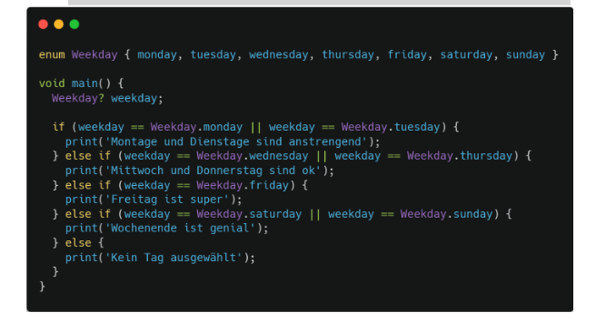

Folgendes Dart Programm zeigt die Verwendung einer if-else-Struktur.
Baue das Programm nach und verwende statt einer if-else-Struktur ein Switch-Statement.
Erstelle für deine Lösung ein GitHub-Repository und gib den Link dazu im Antwortfeld ein.
Welche der beiden Varianten bevorzugst du in diesem Fall? Begründe deine Antwort.
